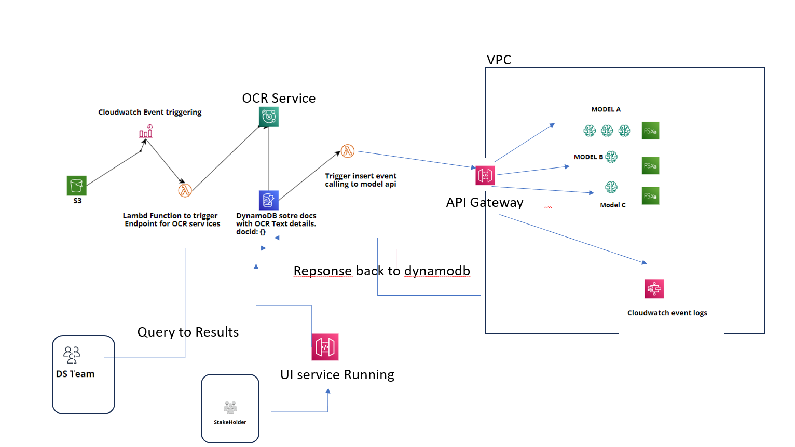

**Design**

• **Ingestion**: Incoming documents are stored in an Amazon S3 bucket.

• **CloudWatch Event Trigger**: Using cloudwatch event trigger, trigger OCR Service using AWS lambda to extract text.

• **Storage** : The processed text metadata is stored in an Amazon DynamoDB table.

• **Event Trigger**: Based on Dynamodb insert event trigger, call Different model endpoints which will take document id as and its processed text as requested.

• **AWS SageMaker**: Store model using Fx Luster shared File system, to access models and run inference.

• **Logging and Monitoring**: Amazon CloudWatch is used to monitor Lambda functions, API Gateway, and DynamoDB.

• **Internal Access**: Data scientists and development team members can access the DynamoDB table directly.

• **Stakeholder Access**: UI service running through API gateway and access DB

**Limitations**:

• Throughput / Latency If the document ingestion rate significantly exceeds this limit, consider sharding the DynamoDB table.
The latency requirements for processing the data. The architecture should be able to process the data in a timely manner.

• Security: IAM roles and policies should be implemented to ensure least privilege access. Data should be encrypted at rest and in transit.

• The architecture does not handle any errors or failures that may occur during the document processing or machine learning tasks.

 
**Improvements**

• Scaling: AWS Step Functions can orchestrate the processing pipeline if the document volume exceeds the initial design.

• Cost Optimization: Using AWS Cost Explorer and Trusted Advisor, you can analyze cost patterns and optimize expenses.

•

• Error Handling: A possible improvement is to use Amazon Simple Notification Service (SNS) or Amazon EventBridge to send notifications or trigger actions when an error or failure occurs

**Justification**
Overall, this architecture is suited for handling the specified document volume and enrichment requirements, while offering a balance of scalability, cost-effectiveness, fault tolerance, and security.

